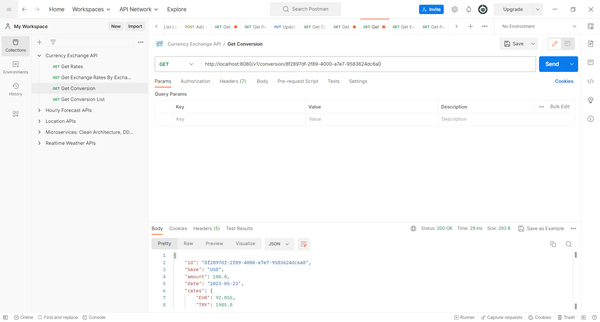

# Spring Boot Currency Change API Example


### 📖 Information

<ul style="list-style-type:disc">
  <li>The <b>purpose</b> of the example is to handle with http get requests regarding currency exchange</li> 
  <li>Here is the explanation of the currency exchange example  
       <ul>
            <li>Get rates from the <b>database</b> if the rate info is already inserted into <b>database</b></li>
            <li>Get rates from <b>apilayer.com</b> and insert its value into <b>database</b> and return the <b>rate</b> info</li>
            <li>Get exchange rates by exchange request info covering <b>base currency</b>, <b>target currency</b> and lastly <b>amount</b></li>
            <li>Get conversion by rate id</li>
            <li>Get all conversions between two dates named <b>start date</b> and <b>end date</b> </li>
       </ul>
  </li>
</ul>

### Explore Rest APIs

<table style="width:100%">
  <tr>
      <th>Method</th>
      <th>Url</th>
      <th>Description</th>
      <th>Valid Request Params</th>
      <th>Valid Path Variable</th>
  </tr>
  <tr>
      <td>GET</td>
      <td>/v1/rate</td>
      <td>Get Rates</td>
      <td><a href="README.md#getrates">Info</a></td>
      <td></td>
  </tr>
  <tr>
      <td>GET</td>
      <td>/v1/exchange</td>
      <td>Get Exchange Rates By Exchange Request Info</td>
      <td><a href="README.md#getexchangeratesbyexchangerequestinfo">Info</a></td>
      <td></td>
  </tr>
  <tr>
      <td>GET</td>
      <td>getconversion</td>
      <td>Get Conversion By Id</td>
      <td></td>
      <td><a href="README.md#getgetconversion">Info</a></td>
  </tr>
  <tr>
      <td>GET</td>
      <td>getconversionlist</td>
      <td>Get Conversion List</td>
      <td><a href="README.md#getconversionlist">Info</a></td>
      <td></td>
  </tr>
</table>

### Valid Request Params

##### <a id="getrates"> Get Rates
```
    http://localhost:8080/v1/rate?base=USD&target=EUR,TRY&date=2023-05-21
    
    base: USD
    target: EUR,TRY
    date: 2023-05-21
```

##### <a id="getexchangeratesbyexchangerequestinfo"> Get Exchange Rates By Exchange Request Info
```
    http://localhost:8080/v1/exchange?base=USD&target=EUR,TRY&amount=100
    
    base: USD
    target: EUR
    amount: 100
```

##### <a id="getexchangeratesbyexchangerequestinfo"> Get Exchange Rates By Exchange Request Info
```
    http://localhost:8080/v1/exchange?base=USD&target=EUR,TRY&amount=100
    
    base: USD
    target: EUR
    amount: 100
```

##### <a id="getconversionlist"> Get Conversion List
```
    http://localhost:8080/v1/conversion?startDate=2023-05-20&endDate=2023-05-22
    
    startDate: 2023-05-20
    endDate: 2023-05-22
```

### Valid Path Variable

##### <a id="getconversion"> Get Conversion
```
    http://localhost:8080/v1/conversion/17d98364-e435-40d7-a941-af535fc95065
```

### Technologies

---
- Java 17
- Spring Boot 3.0
- Open API Documentation
- Restful API
- Spring Cache
- Actuator
- Resilience4j
- Lombok
- Maven
- Junit5
- Mockito
- Integration Tests
- Docker
- Docker Compose

### Prerequisites

---
- Get API KEY from apilayer.com
- Maven or Docker
---

### Get API KEY from apilayer.com
1 ) Open and register <b>apilayer.com</b>

2 ) Register <b>Exchange Rates Data API</b> and Get <b>API key</b>


### Create .env and Define API key
---
    EXCHANGE_API_API_KEY={YOUR_API_KEY}
---

### Docker Run
The application can be built and run by the `Docker` engine. The `Dockerfile` has multistage build, so you do not need to build and run separately.

Please follow directions shown below in order to build and run the application with Docker Compose file;

```sh
$ cd currencyexchange
$ docker-compose up -d
```

---
### Maven Run
To build and run the application with `Maven`, please follow the directions shown below;

```sh
$ cd currencyexchange
$ mvn clean install
$ mvn spring-boot:run
```

### Swagger
You can reach the swagger-ui through the link shown below
```
    http://localhost:8080/swagger-ui/index.html
```

### Actuator
You can reach the actuator through the link shown below
```
    http://localhost:8080/actuator
```

### Screenshots

<details>
<summary>Click here to show the screenshots of project</summary>
    <p> Figure 1 </p>
    
    <p> Figure 2 </p>
    
    <p> Figure 3 </p>
    
    <p> Figure 4 </p>
    
    <p> Figure 5 </p>
    
</details>